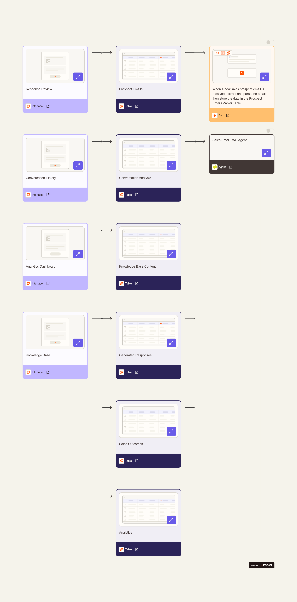

# RAG-Based Automated Sales Conversation Engine

> **Intelligent sales automation that transforms conversations with credible, case study-backed responses.**

This sophisticated workflow orchestrates the complete sales intelligence lifecycle—from prospect email analysis to delivering personalized, credibility-enhanced replies using advanced conversation intelligence and RAG (Retrieval-Augmented Generation).

## 📊 Workflow Overview
Complete system architecture showing data flow from email input to personalized response.




## 🎯 **What This System Does**

- **📧 Intelligent Email Processing**: Automatically captures and parses prospect emails
- **🧠 AI-Powered Analysis**: Extracts sales signals, intent, sentiment, and buying stage
- **📚 RAG Knowledge Matching**: Matches relevant case studies to prospect needs
- **✍️ Personalized Response Generation**: Creates credible, context-aware replies
- **👥 Sales Team Review**: Provides interface for human oversight and approval
- **📊 Performance Analytics**: Tracks conversion rates and system effectiveness

## 🏗️ **System Architecture**

### **Core Components**

| Component | Type | Purpose |
|-----------|------|---------|
| **Email Processing Zap** | Automation | Captures prospect emails and stores data |
| **Sales Email RAG Agent** | AI Agent | Orchestrates analysis and response generation |
| **Response Review Interface** | Form | Sales team review and approval dashboard |
| **6 Data Tables** | Storage | Structured data for emails, analysis, and outcomes |

### **Data Flow**
1. **Email Trigger** → Prospect emails captured automatically
2. **AI Analysis** → Extract intent, sentiment, company context, pain points  
3. **Knowledge Matching** → Find relevant case studies and materials
4. **Response Generation** → Create personalized, credible draft responses
5. **Human Review** → Sales team reviews, edits, and approves
6. **Analytics** → Track performance and conversion outcomes

## 🚀 **Quick Start Guide**

### **Prerequisites**
- Zapier account (Professional plan recommended)
- OpenAI API access
- Email integration (Gmail, Outlook, etc.)
- Case study materials and sales content

### **1. Clone the Workflow Structure**

#### **A) Create Tables** (6 tables total)

**Prospect Emails Table:**
Fields:

Email ID (Text)
Sender Name (Text)
Sender Email (Email)
Received Date (DateTime)
Subject (Text)
Body (Long Text)
```
Conversation Analysis Table:

Fields:
- Email ID (Text) - Links to Prospect Emails
- Intent Signal (Text)
- Buying Stage (Text)
- Sentiment (Text)
- Company Context (Long Text)
- Pain Points (Long Text)

Knowledge Base Content Table:

Fields:
- Content ID (Text)
- Type (Text) - case study, product info, pricing
- Title (Text)
- Content Body (Long Text)
- Tags (Text) - for search/matching

Generated Responses Table:

Fields:
- Response ID (Text)
- Email ID (Text) - Links to original email
- Draft Response (Long Text)
- Matched Case Studies (Long Text)
- Status (Text) - draft, reviewed, sent
- Last Edited By (Text)
- Approval Status (Text)

Sales Outcomes Table:

Fields:
- Outcome ID (Text)
- Email ID (Text)
- Response ID (Text)
- Outcome (Text) - won, lost, follow-up
- Conversion Date (DateTime)

Analytics Table:

Fields:
- Metric (Text)
- Value (Number)
- Period (Text) - daily, weekly, monthly

B) Create Email Processing Zap
Trigger: Email Parser by Zapier (or your email app)
Actions:

Parse email content
Create record in Prospect Emails table
C) Create RAG Agent
Agent Instructions:

When a new prospect email is received:

1. ANALYZE: Extract sales signals from the email:
   - Intent level and buying stage
   - Sentiment (positive, neutral, negative)
   - Company context and background
   - Specific pain points mentioned

2. SEARCH: Find relevant content from Knowledge Base:
   - Match prospect needs to case studies
   - Identify applicable product information
   - Select relevant social proof

3. GENERATE: Create personalized draft response:
   - Address specific pain points
   - Include matched case studies
   - Maintain professional, credible tone
   - Include clear next steps

4. STORE: Save all data in appropriate tables
   - Log analysis results
   - Store draft response with matched content
   - Update analytics metrics

D) Create Review Interface
Pages to create:

Response Review: Table view of Generated Responses with edit capabilities
Conversation History: View all prospect interactions
Analytics Dashboard: Performance metrics and KPIs
Knowledge Base Manager: Add/update case studies and content
2. Configure Your Knowledge Base
Upload your sales materials to the Knowledge Base Content table:

Example entries:
- Case Study: "SaaS Company Increased Revenue 40%"
- Product Sheet: "Enterprise Features Overview"
- Pricing: "Standard vs Premium Comparison"
- Testimonial: "Customer Success Story - Acme Corp"
